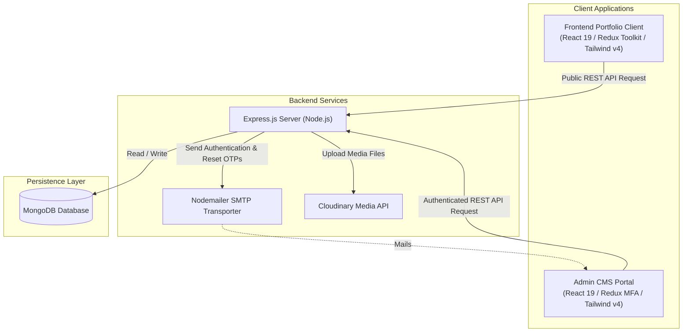

# Portfolio Workspace Architecture & Systems Guide

Welcome to the **Anb Portfolio** codebase. This repository contains the complete systems architecture for a dynamic developer portfolio website, featuring a Node.js API gateway, a client-facing landing page, and a secure content management system (CMS) dashboard.

---

## 1. System Overview & Architecture

The application is structured as a decoupled three-tier system:



### Module Breakdown
1. **[Backend API Server](file:///e:/Anb_Carfts_Projects/Target%20CV/Portfolio/backend)**: Serves REST endpoints for portfolio configuration, content updates, messaging pipelines, media library management, and two-step MFA admin login.
2. **[Frontend Portfolio Client](file:///e:/Anb_Carfts_Projects/Target%20CV/Portfolio/frontend)**: A highly interactive, performant web application featuring animations (Framer Motion) and fallback databases (`src/DB`) to support visual continuity when disconnected from the API.
3. **[Admin CMS Dashboard](file:///e:/Anb_Carfts_Projects/Target%20CV/Portfolio/admin)**: A secure CMS enabling full CRUD operations for projects, skills, certificates, resumes, testimonials, and inbox logs.

---

## 2. Directory Mapping

The repository has the following directory structure:

```
Portfolio/
├── admin/                 # Admin CMS dashboard portal client
├── assets/                # Design assets and mockups/screenshots
├── backend/               # Node.js + Express API server
└── frontend/              # Public-facing portfolio client website
```

For detailed documentation on each component, refer to the module-specific documentation:
*   [Backend Architecture & Database Setup Guide](file:///e:/Anb_Carfts_Projects/Target%20CV/Portfolio/backend/README.md)
*   [Frontend Architecture & Dynamic Rendering Guide](file:///e:/Anb_Carfts_Projects/Target%20CV/Portfolio/frontend/README.md)
*   [Admin CMS Architecture & Security Guide](file:///e:/Anb_Carfts_Projects/Target%20CV/Portfolio/admin/README.md)

---

## 3. Getting Started

### Prerequisites
Make sure you have the following installed on your machine:
*   **Node.js**: v18.x or above (Recommended v20+)
*   **MongoDB**: Local installation or MongoDB Atlas cluster instance.
*   **Cloudinary Account**: For managing image uploads.
*   **Gmail App Password**: For sending authentication and password reset OTPs.

### Environment Configurations

Configure `.env` files in each sub-directory before starting the services. Template references:

1.  **Backend Environment** (`backend/.env`):
    ```env
    PORT=5000
    MONGO_URI=mongodb+srv://<username>:<password>@cluster.mongodb.net/portfolio
    JWT_SECRET=your_jwt_access_secret_key
    JWT_REFRESH_SECRET=your_jwt_refresh_secret_key
    CLIENT_URL=http://localhost:5173
    ADMIN_URL=http://localhost:5174
    NODE_ENV=development
    
    # SMTP Nodemailer Settings
    SMTP_HOST=smtp.gmail.com
    SMTP_PORT=465
    SMTP_SERVICE=gmail
    SMTP_MAIL=your_email@gmail.com
    SMTP_PASSWORD=your_gmail_app_password
    
    # SuperAdmin Auto-seed Credentials
    SUPERADMIN_EMAIL=your_email@gmail.com
    SUPERADMIN_PASSWORD=your_secure_password
    
    # Cloudinary Upload Credentials
    CLOUDINARY_CLOUD_NAME=your_cloudinary_cloud_name
    CLOUDINARY_API_KEY=your_cloudinary_api_key
    CLOUDINARY_API_SECRET=your_cloudinary_api_secret
    ```

2.  **Frontend Web App Environment** (`frontend/.env`):
    ```env
    VITE_API_URL=http://localhost:5000/api
    ```

3.  **Admin CMS Environment** (`admin/.env`):
    ```env
    VITE_API_URL=http://localhost:5000/api
    ```

---

## 4. Run Scripts & Commands

To launch and test the portfolio system locally:

### 1. Launch the Backend
Navigate to the `backend` workspace and start the API:
```powershell
cd backend
npm install
npm run dev
```
On boot, the backend automatically connects to MongoDB, seeds the SuperAdmin user (if not already seeded), and listens on port `5000`.

### 2. Launch the Public Website
Navigate to the `frontend` workspace and start the React dev server:
```powershell
cd frontend
npm install
npm run dev
```
The client website starts running on port `5173`.

### 3. Launch the Admin Portal
Navigate to the `admin` workspace and start the CMS dev server:
```powershell
cd admin
npm install
npm run dev
```
The admin portal runs on port `5174`.

---

## 5. Security & Multi-Factor Authentication (MFA)
Accessing the admin portal requires passing a secure MFA flow:
1.  **Initial Authentication**: Submit the SuperAdmin email and password.
2.  **OTP Verification**: The server generates a cryptographically random, 6-digit OTP code, saves it to the database with a 10-minute expiry window, and emails it using Nodemailer. 
3.  **Authentication Handshake**: Submitting the correct OTP finishes the handshake, storing a HTTP-Only secure cookie (`refreshToken`) and sending an `accessToken` in the JSON response body.
