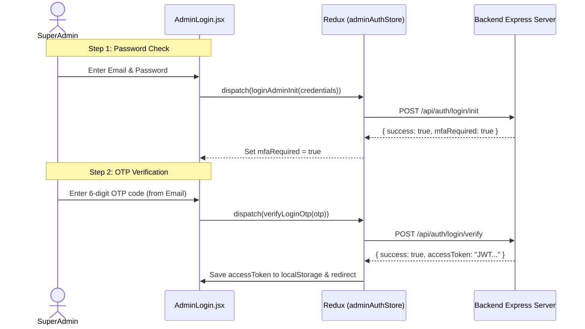
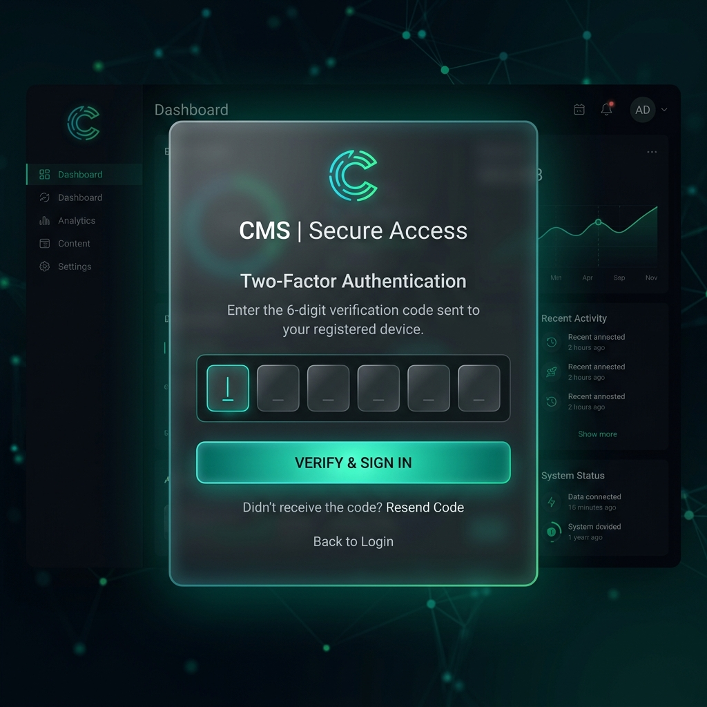
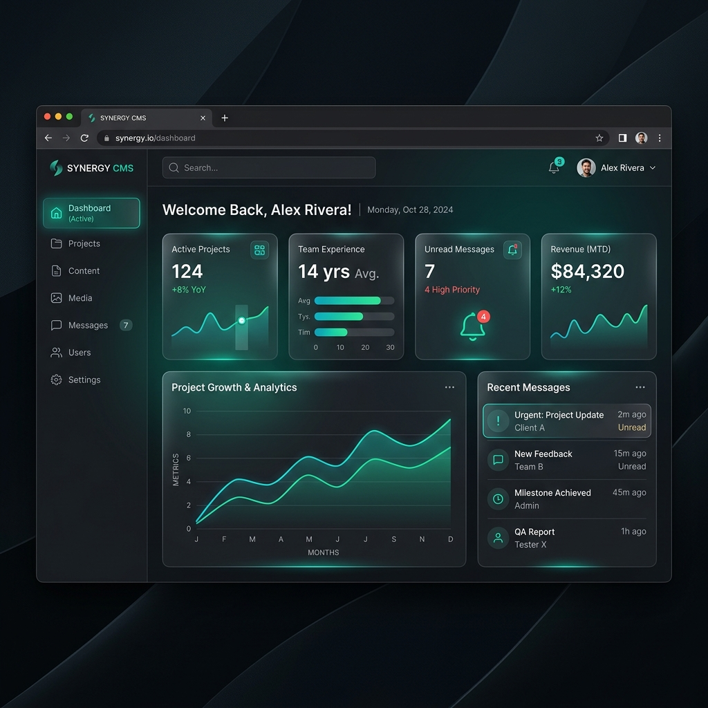

# Portfolio Admin CMS Portal Guide

This is the content management system (CMS) admin dashboard for the developer portfolio. It provides a secure interface for the SuperAdmin to manage all portfolio data, read/respond to incoming contact messages, update social accounts, and catalog media files uploaded directly to Cloudinary.

---

## 1. Technical Stack
*   **Core framework**: React 19 (Vite Single Page Application bundler)
*   **Styling (CSS)**: Tailwind CSS v4
*   **State Management**: Redux Toolkit & React Redux
*   **HTTP Client**: Axios (configured with token storage and credentials support)
*   **Routing**: React Router DOM (with protected route checks)
*   **Icons**: Lucide React

---

## 2. Folder Structure Overview

```
admin/
├── src/
│   ├── Api/               # API service scripts
│   ├── Axios/             # Axios instance configurations
│   ├── Components/        # Shared CMS layouts (Sidebar, Navbar)
│   ├── Pages/             # Dashboard CMS panels
│   ├── Store/             # Redux state controllers & thunks
│   ├── App.css            # Stylesheets
│   ├── App.jsx            # Router and layout controller
│   ├── index.css          # Core CSS boot
│   └── main.jsx           # Mounting loader
```

### Folder Roles
*   **[Api](file:///e:/Anb_Carfts_Projects/Target%20CV/Portfolio/admin/src/Api)**: Houses HTTP request functions mapping to the backend (e.g. [auth.api.js](file:///e:/Anb_Carfts_Projects/Target%20CV/Portfolio/admin/src/Api/auth.api.js), [project.api.js](file:///e:/Anb_Carfts_Projects/Target%20CV/Portfolio/admin/src/Api/project.api.js)).
*   **[Axios](file:///e:/Anb_Carfts_Projects/Target%20CV/Portfolio/admin/src/Axios)**: Builds [axiosInstance.js](file:///e:/Anb_Carfts_Projects/Target%20CV/Portfolio/admin/src/Axios/axiosInstance.js) which dynamically appends the stored `adminToken` JWT from local storage into request authorization headers:
    ```javascript
    axiosInstance.interceptors.request.use((config) => {
      const token = localStorage.getItem("adminToken");
      if (token) {
        config.headers.Authorization = `Bearer ${token}`;
      }
      return config;
    });
    ```
*   **[Components](file:///e:/Anb_Carfts_Projects/Target%20CV/Portfolio/admin/src/Components)**: Exports global structures like:
    *   `Sidebar.jsx` (Navigation linkages)
    *   `Navbar.jsx` (Dashboard header showing user details and logout triggers)
    *   `ProtectedRoute.jsx` (Enforces authenticated sessions)
    *   `AdminLayout.jsx` (Side-by-side split screen structure layout)
*   **[Pages](file:///e:/Anb_Carfts_Projects/Target%20CV/Portfolio/admin/src/Pages)**: Page panels dedicated to CRUD actions on specific database models.
*   **[Store](file:///e:/Anb_Carfts_Projects/Target%20CV/Portfolio/admin/src/Store)**: Implements Redux actions, slices, and combined stores.

---

## 3. Auth Security Architecture

Access to the CMS is locked behind a strict authentication workflow managed inside [adminAuthStore.js](file:///e:/Anb_Carfts_Projects/Target%20CV/Portfolio/admin/src/Store/adminAuthStore.js) and rendered in [AdminLogin.jsx](file:///e:/Anb_Carfts_Projects/Target%20CV/Portfolio/admin/src/Pages/AdminLogin.jsx):



### Password Recovery Pipeline
If the password is forgotten:
1.  **Request Reset OTP**: Input the Admin email address. Redux dispatches `forgotPasswordAdmin` which triggers `/api/auth/forgot-password` to email a verification OTP.
2.  **Confirm New Password**: Submit the received OTP, email, and new secure password. Redux dispatches `resetPasswordAdmin` calling `/api/auth/reset-password` to save the updated credentials to the DB.

---

## 4. CMS Redux Store & Generic CRUD Factory

To avoid redundant code duplication, Redux CMS controllers leverage a **Generic CRUD Thunk Factory** inside [cmsStore.js](file:///e:/Anb_Carfts_Projects/Target%20CV/Portfolio/admin/src/Store/cmsStore.js):

### Thunk Builder Factory
```javascript
const buildCrudThunks = (name, { getAll, create, update, remove }) => ({
  fetchAll: createAsyncThunk(`cms/${name}/fetchAll`, async (params = {}, { rejectWithValue }) => { ... }),
  create: createAsyncThunk(`cms/${name}/create`, async (payload, { rejectWithValue }) => { ... }),
  update: createAsyncThunk(`cms/${name}/update`, async ({ id, payload }, { rejectWithValue }) => { ... }),
  remove: createAsyncThunk(`cms/${name}/remove`, async (id, { rejectWithValue }) => { ... }),
});
```

Using this factory pattern, async handlers are instantiated with minimal declarations:
```javascript
export const projectThunks = buildCrudThunks('projects', {
  getAll: projectApi.getAllProjects,
  create: projectApi.createProject,
  update: projectApi.updateProject,
  remove: projectApi.deleteProject
});
```
This slice manages loading indicators, error triggers, and keeps UI states synchronized instantly on CRUD events.

---

## 5. Dashboard Panels & Pages

*   **Dashboard Analytics** ([DashboardHome.jsx](file:///e:/Anb_Carfts_Projects/Target%20CV/Portfolio/admin/src/Pages/DashboardHome.jsx)): Displays summary statistics (counters of active projects, stories, skills, experiences, certifications) and list highlights of unread inbox messages.
*   **Projects Manager** ([ProjectCMS.jsx](file:///e:/Anb_Carfts_Projects/Target%20CV/Portfolio/admin/src/Pages/ProjectCMS.jsx)): Grid listing of projects allowing creation, updating, or deleting. Features fields for category filtering, thumbnail assets, tech stack tags, demo video links, and status triggers (Active/Draft).
*   **Journey Stories** ([StoryCMS.jsx](file:///e:/Anb_Carfts_Projects/Target%20CV/Portfolio/admin/src/Pages/StoryCMS.jsx)): Timeline event builder for portfolio stories (Hackathons, Milestones). Handles timeline arrays, location tags, years, and galleries.
*   **Skills Grid** ([SkillsCMS.jsx](file:///e:/Anb_Carfts_Projects/Target%20CV/Portfolio/admin/src/Pages/SkillsCMS.jsx)): Manages category tags, proficiency percentages, icon selections, and order listings.
*   **Experience & Education** ([ExperienceCMS.jsx](file:///e:/Anb_Carfts_Projects/Target%20CV/Portfolio/admin/src/Pages/ExperienceCMS.jsx)): Timeline editor tracking company names, descriptions, timelines, and skills.
*   **Certifications** ([CertificationsCMS.jsx](file:///e:/Anb_Carfts_Projects/Target%20CV/Portfolio/admin/src/Pages/CertificationsCMS.jsx)): Lists titles, issuing organizations, dates, and credential links.
*   **Resumes Manager** ([ResumeCMS.jsx](file:///e:/Anb_Carfts_Projects/Target%20CV/Portfolio/admin/src/Pages/ResumeCMS.jsx)): Catalog of uploaded PDF resumes. Toggling a resume "Active" automatically updates and disables other resumes on the backend.
*   **Inbox Manager** ([InboxCMS.jsx](file:///e:/Anb_Carfts_Projects/Target%20CV/Portfolio/admin/src/Pages/InboxCMS.jsx)): Displays incoming user messages. Features status updates (`Read`/`Replied`/`Archived`) and item deletion.
*   **Media Library** ([MediaLibraryCMS.jsx](file:///e:/Anb_Carfts_Projects/Target%20CV/Portfolio/admin/src/Pages/MediaLibraryCMS.jsx)): File catalog list allowing direct local uploads. Multi-part form uploads are processed by the backend, saved to Cloudinary, and cataloged. Allows manual deletion which cleans up files from both Cloudinary storage and the database.
*   **Site Configuration** ([SiteSettingsCMS.jsx](file:///e:/Anb_Carfts_Projects/Target%20CV/Portfolio/admin/src/Pages/SiteSettingsCMS.jsx)): Global parameters editor (social links, email contact, phone number, location).

---

## 6. Panel Screenshots

Here are mockups of the core panels:

### 1. Two-Step MFA Login Form
Features a clean login UI containing initial credentials check, OTP code validation, and a modal for forgotten password recovery.



### 2. CMS Dashboard Control Center
The main landing dashboard featuring summary data analytics widgets, navigation layouts, and direct quick-action controls.



---

## 7. Running Commands

From the `/admin` directory:
*   **Install dependencies**:
    ```powershell
    npm install
    ```
*   **Run development server**:
    ```powershell
    npm run dev
    ```
    The admin portal starts running locally on port `5174`.
*   **Build production files**:
    ```powershell
    npm run build
    ```
*   **Preview production build locally**:
    ```powershell
    npm run preview
    ```
